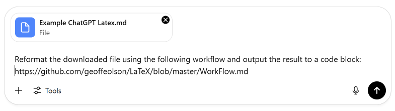

# LaTeX Workflow for GitHub Markdown

This repository provides a workflow for converting LaTeX equations in Markdown files from the format used by ChatGPT into a format that renders correctly on GitHub. It enables the creation of professional-looking LaTeX equations in GitHub documents, such as README files.

## Overview

GitHub supports LaTeX equations within Markdown files, but it has specific formatting requirements that differ from other LaTeX renderers, such as ChatGPT’s internal LaTeX system. This workflow helps convert LaTeX equations from ChatGPT's default format to one that is compatible with GitHub’s KaTeX engine.

You can provide this workflow to ChatGPT whenever you want to create a Markdown document that includes LaTeX equations, such as a README file for a GitHub repository. ChatGPT will automatically adjust the LaTeX equations to ensure they render correctly on GitHub. 

Alternatively, you can read and follow this workflow manually to convert your LaTeX content for proper GitHub rendering.

## Key Features

- **Convert LaTeX Equations:** Automatically transform ChatGPT-generated LaTeX into a format that renders correctly on GitHub.
- **Formatting Guidelines:** Read the `Workflow.md` document to learn how to adjust LaTeX for GitHub’s KaTeX engine and avoid common rendering issues.
- **Support for Inline & Block Equations:** Handles both inline and display block LaTeX equations, ensuring consistency across your documents.

## Getting Started

If you want to create a `README.md` file for your repository with equations, simply ask ChatGPT to create the file for you. ChatGPT can help generate all the LaTeX equations.

When instructing ChatGPT to create the final document for GitHub, give it a link to this workflow so it knows how to reformat the LaTeX:
https://github.com/geoffeolson/LaTeX/blob/master/WorkFlow.md

You can also upload an existing Markdown document with LaTeX equations into ChatGPT and ask it to reformat the file for GitHub. Just provide the same link to the workflow.

## ChatGPT Document Upload

Below is a visual example of uploading a file into ChatGPT:



## Sample Input and Output

This shows how the workflow converts LaTeX equations from ChatGPT format to GitHub format.

**Input:**

```
Let \( x = y + z \). The equation is \( A_{ij} = B_{ij} + C_{ij} \).

\[
\mathbf{x}_i = \begin{bmatrix} x_i \\ y_i \\ \theta_i \end{bmatrix}
\]
```

**Output:**

```
Let $x = y + z$. The equation is $A_{ij} = B_{ij} + C_{ij}$.

$$
\mathbf{x}_i = \begin{bmatrix} 
x_i \\ 
y_i \\ 
\theta_i 
\end{bmatrix}
$$
```
